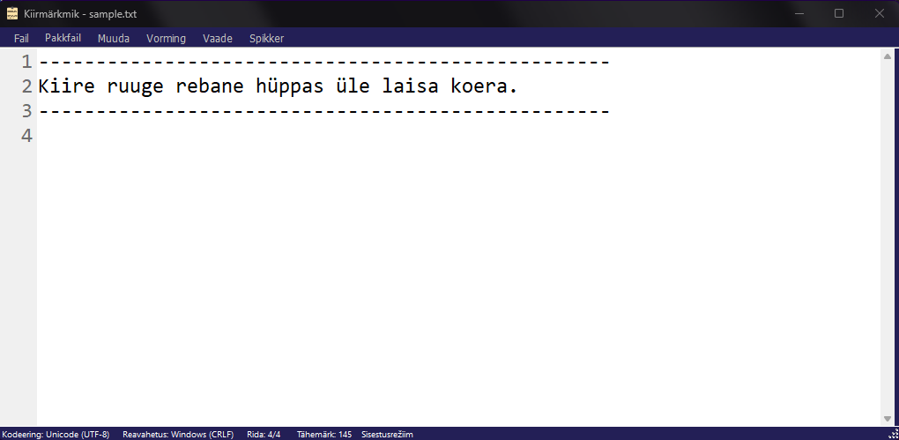

# sharpNotepad

C#-s kirjutatud lihtteksti redigeerimise programm, mis pakub erinevaid lisavõimalusi.

Funktsioonid:
- Integratsioon Markuse arvuti asjad süsteemiga (värviskeemi sünkroniseerimine, Markuse asjad teave)
- Reanumbrid
- Erinevad kodeeringud, sh windows-1252, UTF-16, UTF-8, US-ASCII, UTF-7, UTF-32
- Värviskeemi muutmine
- Mugavusfunktsioonid pakkfailide (ehk siis .bat/.cmd failid) jaoks
- Prefiksi/suffiksi lisamine mitmele reale
- Krahhimine
- Aktiivse dokumendi avamine Notepad-is
